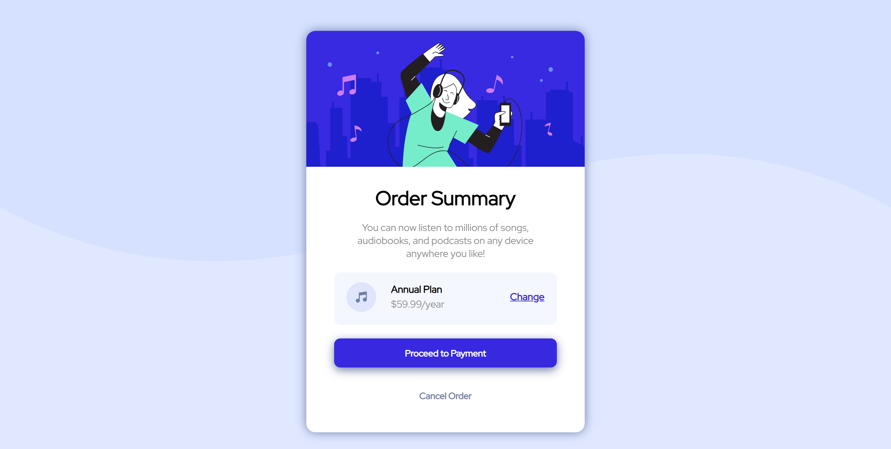
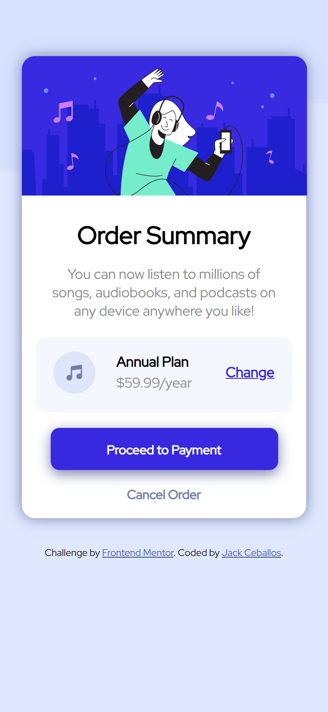

# Frontend Mentor - Order summary card solution

This is a solution to the [Order summary card challenge on Frontend Mentor](https://www.frontendmentor.io/challenges/order-summary-component-QlPmajDUj). Frontend Mentor challenges help you improve your coding skills by building realistic projects. 

## Table of contents

- [Overview](#overview)
  - [The challenge](#the-challenge)
  - [Screenshot](#screenshot)
  - [Links](#links)
- [My process](#my-process)
  - [Built with](#built-with)
  - [What I learned](#what-i-learned)
  - [Useful resources](#useful-resources)
- [Author](#author)

## Overview

### The challenge

Users should be able to:

- See hover states for interactive elements

### Screenshot

- This is the design on a desktop screen width of 1440px


- This is the design on a mobile phone width of 375px


### Links

- Solution URL: [Frontend Mentor Solution](https://www.frontendmentor.io/solutions/responsive-order-summary-card-with-html-and-css-4UK9QNbkC)
- Live Site URL: [Deployed GitHub URL](https://jceb30198.github.io/Order_Summary_Card_Challenge/)

## My process

### Built with

- Semantic HTML5
- CSS
- CSS Media Queries
- Mobile-responsive Workflow

### What I learned

In this challenge I learned how to work with media queries and make a layout more responsive. The challenge called for two different widths: one for desktops at 1440px and the other for mobile devices at 375px. The image on the card-header class was not responsive past 450px originally, so I decided to add a media query for a max-width of 500 px. A portion of the media query can been seen below:

```css
@media (max-width: 500px) {
  body {
    background: hsl(225, 100%, 94%) url('./images/pattern-background-mobile.svg') top/contain no-repeat;
  }

  .card {
    max-width: 325px;
    min-height: 500px;
    margin: 4em auto 2em auto
  }

  .card-header img {
    max-width: 326px;
  }

  .card-header h1 {
    font-size: 1.75em;
  }

  .card-header p {
    padding: 0.5em 2em;
  }
}
```

Another thing I learned in this challenge was to make the responsiveness feel better with pseudo classes and media queries. When using the hover pseudo class on mobile the effect will remain until the user touches another part of their screen, so I decided to combat that by using a media query to change the pseudo class to active on mobile devices. Below is an example of how I used media queries alongside pseudo classes:

```css
@media (min-width: 501px) {
  .right a:hover {
    color: hsl(224, 23%, 55%);
    text-decoration: none;
  }
  
  #proceed-btn:hover {
    background: hsl(224, 23%, 55%);
  }
  
  #cancel-btn:hover {
    color: hsl(223, 47%, 23%);
  }
}

@media (max-width: 500px) {
  .right a:active {
    color: hsl(224, 23%, 55%);
    text-decoration: none;
  }  

  #proceed-btn:active {
    background: hsl(224, 23%, 55%);
  }
  
  #cancel-btn:active {
    color: hsl(223, 47%, 23%);
  }
}
```

### Useful resources

- [MDN Web Docs: CSS Media Queries](https://developer.mozilla.org/en-US/docs/Web/CSS/Media_Queries/Using_media_queries) - Here I read up on media queries and they provide plenty of great examples. I highly recommend this for anyone having trouble learning media queries.

## Author

- Website - [Jack Ceballos](https://jceb30198.github.io/#/)
- Frontend Mentor - [@jceb30198](https://www.frontendmentor.io/profile/jceb30198)